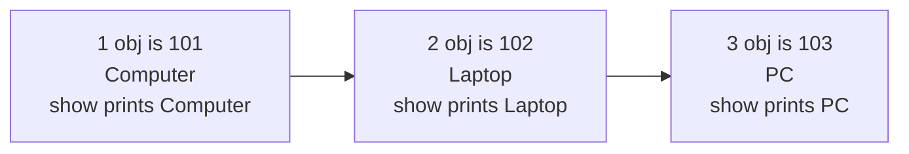

# DynamicMethodDispatch

`obj` is always a `Computer` reference. The object behind it changes. `show` runs on that object, so Laptop and PC use their own `show`, not `Computer.show`.

```mermaid
flowchart LR
  one["1 obj is 101<br/>Computer<br/>show prints Computer"]
  two["2 obj is 102<br/>Laptop<br/>show prints Laptop"]
  three["3 obj is 103<br/>PC<br/>show prints PC"]
  one --> two --> three
```
